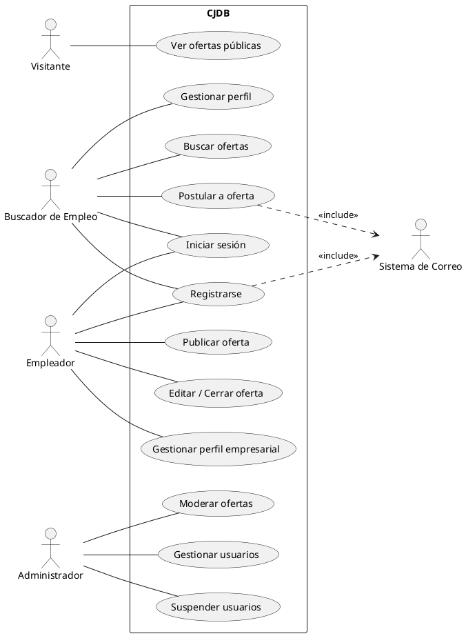
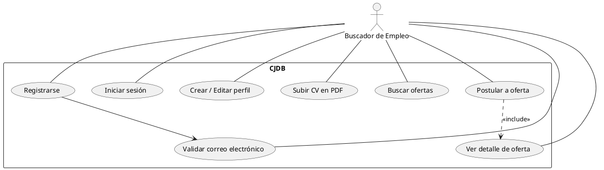
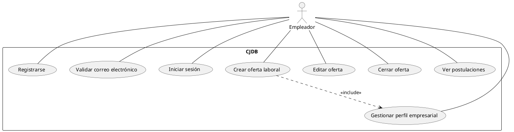
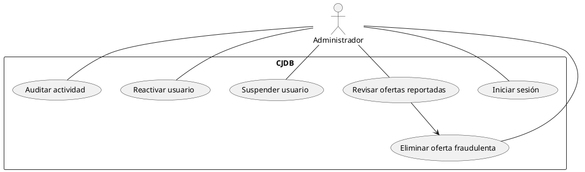

# Diagramas de Casos de Uso (Use Case Diagrams)

Proyecto: **Banco de Datos de Empleos Comunitarios (CJDB)**  
Basado en: Acta de Constitución del Proyecto y ERS

---

## 1. Introducción

Este documento describe los **diagramas de casos de uso** del sistema CJDB, representando gráficamente las interacciones entre los **actores** y el **sistema**, con el objetivo de:

- Clarificar el alcance funcional del MVP.
- Servir como puente entre los requerimientos (ERS) y el diseño técnico.
- Facilitar la comprensión del sistema a partes no técnicas.

Los diagramas se definen utilizando **PlantUML**, permitiendo su versionado y mantenimiento mediante Markdown.

---

## 2. Actores del Sistema

De acuerdo con los documentos base, el sistema CJDB contempla los siguientes actores:

- **Visitante**: Usuario no autenticado que navega ofertas públicas.
- **Buscador de Empleo**: Usuario registrado que busca y postula a ofertas.
- **Empleador**: Usuario registrado que publica y gestiona ofertas laborales.
- **Administrador**: Rol con privilegios elevados para moderación y control.
- **Sistema de Correo** (Actor externo): Servicio utilizado para verificación y notificaciones.

---

## 3. Diagrama General de Casos de Uso

Este diagrama muestra una vista de alto nivel del sistema CJDB y sus principales interacciones.

---

## 4. Casos de Uso – Buscador de Empleo

### Descripción
El Buscador de Empleo es el actor central del flujo de búsqueda y postulación laboral.

### Casos principales

---

## 5. Casos de Uso – Empleador

### Descripción
El Empleador interactúa con el sistema para gestionar su identidad corporativa y el ciclo de vida de las ofertas laborales.

---

## 6. Casos de Uso – Administrador

### Descripción
El Administrador asegura el correcto funcionamiento, seguridad y legitimidad de la plataforma.

---

## 7. Relación con Requerimientos (Trazabilidad)

| Caso de Uso | Requerimiento ERS |
|------------|------------------|
| Registrarse | RF-01 |
| Gestionar perfil empleador | RF-02 |
| Gestionar perfil buscador | RF-03 |
| Postular a oferta | RF-04 |
| Moderación administrativa | RF-05 |

---

## 8. Notas Finales

- Estos diagramas representan el **estado del MVP**, no funcionalidades futuras.
- Cualquier caso de uso adicional deberá ser evaluado contra el Acta de Constitución para evitar *scope creep*.
- El uso de PlantUML permite mantener este documento sincronizado con la evolución del sistema.

---

**Fin del Documento**

