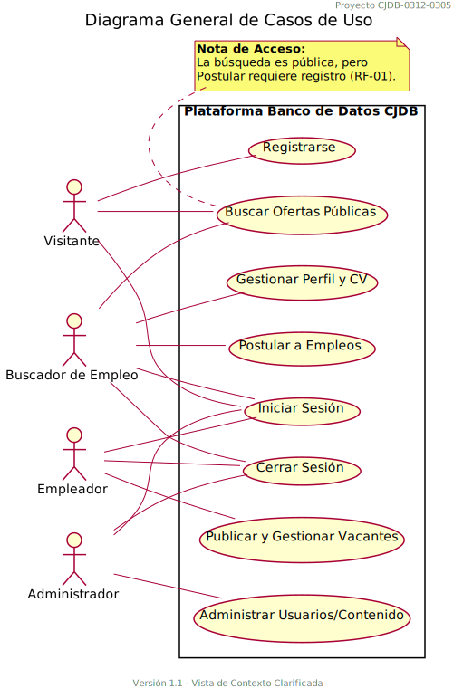
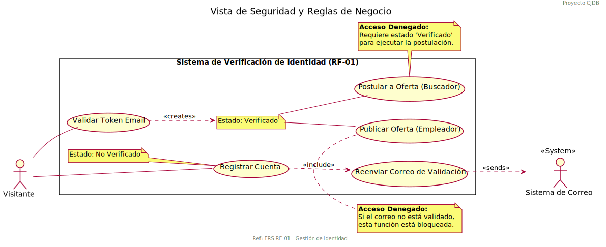

# Documentación de Diagramas de Casos de Uso
## Proyecto: Banco de Datos de Empleos Comunitarios (CJDB)

---

## Índice
1. [Introducción](#introducción)
2. [Glosario de Elementos UML](#glosario-de-elementos-uml)
3. [Diagramas de Casos de Uso](#diagramas-de-casos-de-uso)
4. [Requisitos Funcionales y Trazabilidad](#requisitos-funcionales-y-trazabilidad)

---

## Introducción

Este documento presenta los diagramas de casos de uso del sistema CJDB (Community Jobs Database), una plataforma web centralizada orientada a conectar empleadores locales con buscadores de empleo dentro de la comunidad.

Los diagramas han sido diseñados siguiendo el estándar UML 2.0 y documentan las funcionalidades del sistema organizadas en módulos lógicos según la estructura definida en el Documento de Especificaciones de Requerimientos de Software (ERS).

---

## Glosario de Elementos UML

### 1. Conexiones (Líneas y Flechas)

| Elemento | Símbolo | Descripción |
|----------|---------|-------------|
| **Asociación** | `actor -- usecase` | Representa la interacción entre un actor y un caso de uso. El actor inicia o participa en el caso de uso. |
| **Include (Inclusión)** | `usecase1 ..> usecase2 : <<include>>` | Indica que un caso de uso **siempre** ejecuta otro caso de uso como parte de su flujo. Es una dependencia obligatoria. |
| **Extend (Extensión)** | `usecase1 <.. usecase2 : <<extend>>` | Indica que un caso de uso **opcionalmente** añade comportamiento a otro caso de uso. Es una dependencia condicional. |
| **Creación** | `usecase ..> actor : <<creates>>` | Indica que un caso de uso crea o transiciona a un actor/estado. |
| **Comunicación** | `usecase ..> actor : <<sends>>` | Indica que un caso de uso envía información a un actor externo (ej: sistema de correo). |

### 2. Estereotipos Estándar

| Estereotipo | Uso | Descripción |
|-------------|-----|-------------|
| `<<include>>` | Relación | Dependencia obligatoria. El caso de uso base no puede completarse sin el caso de uso incluido. |
| `<<extend>>` | Relación | Dependencia opcional. El caso de uso extendido añade funcionalidad bajo condiciones específicas. |
| `<<include>>` | Caso de uso | Marca un caso de uso como inclusión obligatoria desde otro. |
| `<<exclude>>` | Caso de uso | Excluye explícitamente un comportamiento del flujo principal. |

### 3. Estereotipos Personalizados del Proyecto

| Estereotipo | Uso | Descripción |
|-------------|-----|-------------|
| `<<Internal>>` | Caso de uso | Representa lógica de negocio interna que no es visible directamente para los actores pero es ejecutada por el sistema. |
| `<<Abstract>>` | Caso de uso | Define una abstracción o validación conceptual usada por otros casos de uso (ej: "Verificar Estado"). |
| `<<System>>` | Actor | Representa un sistema externo que interactúa con el sistema CJDB (ej: Sistema de Correo). |

### 4. Tipos de Elementos Visuales

| Elemento | Símbolo UML | Descripción |
|----------|-------------|-------------|
| **Actor** | `actor "Nombre" as Alias` | Entidad externa que interactúa con el sistema. Puede ser una persona, otro sistema o un dispositivo. |
| **Caso de Uso** | `usecase "Nombre" as Alias` | Funcionalidad del sistema desde la perspectiva del usuario. |
| **Sistema/Frontera** | `rectangle "Nombre"` | Delimita el alcance del sistema y agrupa casos de uso relacionados. |
| **Paquete** | `package "Nombre"` | Agrupa elementos lógicos relacionados dentro del sistema. |
| **Nota** | `note "Texto" as N_Alias` | Proporciona información adicional o restricciones sobre elementos del diagrama. |

### 5. Convenciones de Color y Forma

| Elemento | Color/Forma | Propósito |
|----------|-------------|-----------|
| Actor Principal | Figura de palo (stick figure) | Representa usuarios humanos o sistemas externos |
| Sistema Externo | `<<System>>` | Sistemas externos como correo electrónico |
| Casos de Uso Internos | `<<Internal>>` | Lógica de negocio no visible al usuario |
| Validaciones | `<<Abstract>>` | Verificaciones de estado o reglas de negocio |
| Notas | Rectángulo con esquina doblada | Información complementaria |

---

## Diagramas de Casos de Uso

### Diagrama 00: Master Diagram (Diagrama Maestro)

**Descripción:** Vista consolidada de todos los módulos y actores del sistema CJDB.

**Módulos Incluidos:**
- Módulo 1: Autenticación (RF-01)
- Módulo 2: Gestión Empleador (RF-02)
- Módulo 3: Búsqueda y Postulación (RF-03/04)
- Módulo 4: Back-Office (RF-05)

**Actores:** Visitante, Buscador de Empleo, Empleador, Administrador, Sistema de Correo

---

### Diagrama 01: Context Overview (Vista de Contexto)

**Descripción:** Mapa general de acceso por rol sin herencias confusas.

**Funciones Principales:**
- Registro e Inicio de Sesión
- Búsqueda de Ofertas Públicas
- Gestión de Perfil y CV
- Postulación a Empleos
- Administración de Vacantes
- Moderación de Usuarios/Contenido

**Nota Importante:** La búsqueda es pública, pero postular requiere registro.

---

### Diagrama 02: Authentication (Autenticación y Seguridad)

**Descripción:** Módulo de identidad y acceso con distinción clara entre visitantes y usuarios autenticados.

**Casos de Uso:**
- Registrar Cuenta (Visitor)
- Iniciar Sesión
- Recuperar Contraseña
- Validar Token Email
- Cerrar Sesión (Autenticados)
- Enviar Correo de Verificación (Internal)

**Transición:** Al validar el token o hacer login, el Visitante se convierte en Usuario.

---

### Diagrama 03: Job Management (Gestión de Ofertas y Empresa)

**Descripción:** Gestión del perfil corporativo y ciclo de vida de vacantes.

**Sub-paquetes:**
- Gestión Corporativa (RF-02): Perfil Empresa, Cargar Logo/Descripción
- Gestión de Vacantes: Publicar, Editar/Cerrar, Ver Postulaciones, Descargar CV

**Validación:** Requiere cuenta verificada para publicar ofertas.

---

### Diagrama 04: Search Application (Búsqueda y Postulación)

**Descripción:** Flujo del Buscador de Empleo con restricciones técnicas y validaciones de negocio.

**Casos de Uso:**
- Buscar Ofertas
- Filtrar (Categoría/Salario) - Extendido
- Ver Detalle de Oferta
- Gestionar Perfil
- Cargar/Actualizar CV (PDF, máx 5MB)
- Postular a Vacante
- Validar Postulación Única (Internal)
- Verificar Email Validado (Abstract)
- Notificar Postulación (Internal)

**Validaciones:**
- Usuario debe estar autenticado
- No puede postularse dos veces a la misma oferta
- Solo formato PDF para CV

---

### Diagrama 05: Administration (Administración y Back-Office)

**Descripción:** Panel de control para Administradores con herramientas de moderación.

**Casos de Uso:**
- Listar Usuarios y Ofertas
- Auditar Contenido (Extended)
- Ver Métricas Globales
- Suspender Usuario (Extended)
- Dar de Baja Oferta (Extended)

**Regla de Moderación:** Se eliminan ofertas fraudulentas o que violen normas comunitarias.

---

### Diagrama 06: Security Validation (Seguridad y Validación)

**Descripción:** Diagrama de impacto de la validación de correo (Token) y funciones protegidas.

**Flujo de Verificación:**
1. Visitante se registra → Sistema envía correo de validación
2. Visitante valida token → Estado: Verificado
3. Usuario verificado puede acceder a funciones protegidas

**Funciones Protegidas:**
- Publicar Oferta (Empleador)
- Postular a Oferta (Buscador)

**Acceso Denegado:** Si el correo no está validado, estas funciones están bloqueadas.

---

## Requisitos Funcionales y Trazabilidad

| RF | Requisito | Diagramas | Casos de Uso |
|----|-----------|-----------|--------------|
| RF-01 | Registro y Validación de Usuarios | 00, 02, 06 | Registrarse, Validar Token Email, Enviar Correo de Verificación |
| RF-02 | Gestión de Perfil de Empleador | 00, 03 | Gestionar Perfil Empresa, Cargar Logo/Descripción, Publicar/Cerrar Vacante |
| RF-03 | Gestión de Perfil de Buscador | 00, 04 | Gestionar Perfil/CV, Cargar CV (PDF, 5MB) |
| RF-04 | Motor de Postulación | 00, 04 | Postular a Vacante, Validar Postulación Única |
| RF-05 | Moderación Administrativa | 00, 05 | Moderar Usuarios/Ofertas, Suspender Usuario, Dar de Baja Oferta |

---

## Actores del Sistema

| Actor | Descripción | Funciones Principales |
|-------|-------------|----------------------|
| **Visitante** | Usuario no autenticado | Registrarse, Iniciar Sesión, Recuperar Contraseña, Validar Token, Buscar Ofertas |
| **Buscador de Empleo** | Usuario registrado y autenticado | Gestionar Perfil/CV, Buscar Ofertas, Postular a Vacantes, Cerrar Sesión |
| **Empleador** | Usuario con rol empresarial | Gestionar Perfil Empresa, Publicar/Cerrar Vacantes, Ver Postulaciones, Descargar CV, Cerrar Sesión |
| **Administrador** | Usuario con permisos elevados | Listar Usuarios/Ofertas, Auditar Contenido, Ver Métricas, Suspender Usuarios, Dar de Baja Ofertas, Cerrar Sesión |
| **Sistema de Correo** | Sistema externo | Enviar notificaciones y tokens de verificación |

---

## Convenciones de Nombres

### Casos de Uso
- **Formato:** Verbo en infinitivo + objeto + contexto
- **Ejemplos:** "Registrarse", "Publicar Vacante", "Cargar CV (PDF)"

### Actores
- **Formato:** Sustantivo que representa el rol
- **Ejemplos:** "Buscador de Empleo", "Sistema de Correo"

### Alias
- **Formato:** Prefijo UC_ + nombre descriptivo en camelCase
- **Ejemplos:** UC_Reg, UC_Apply, UC_CorpProfile

---

## Notas Técnicas

### Precondiciones de Seguridad (RF-01)
- La validación del correo mediante token es obligatoria para:
  - Publicar ofertas (Empleador)
  - Postular a ofertas (Buscador)
- El sistema registra de forma auditable el estado y fecha de validación del correo.

### Restricciones Técnicas (RF-03)
- Formato obligatorio para CV: **PDF**
- Tamaño máximo permitido: **5 MB**

### Validaciones de Negocio (RF-04)
- Un usuario no puede postularse dos veces a la misma oferta.
- Se valida que el usuario esté autenticado antes de permitir postulación.

---

## Referencias

- **Proyecto:** Banco de Datos de Empleos Comunitarios (CJDB)
- **Código:** CJDB-0312-0305-2526
- **Versión ERS:** 1.0 (04 de febrero de 2026)
- **Universidad:** UNEG - Área de Ingeniería en Sistemas
- **Materia:** Sistemas de Información I

---

*Documento generado según estándares UML 2.0 para documentación de casos de uso.*
